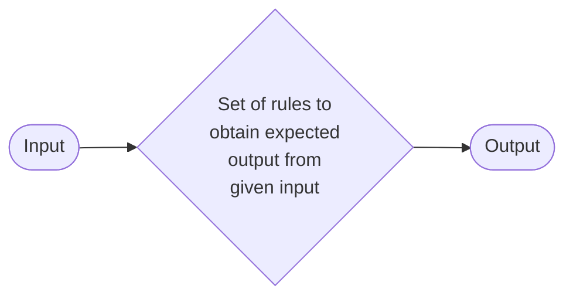

 # Algorithm

An algorithm is a sequence of unambiguous instructions for solving a problem, i.e., for obtaining a required output for any legitimate input in a finite amount of time.

## Characteristics of an Algorithm

InputOutputFinitenessDefinitenessCorrectness

## Fundamentals of Algorithmic Problem Solving

```mermaid
flowchart TD
    A[Understand the Problem] --> B[Decide on Computational Means<br>(Exact vs Approximate Solving)]
    B --> C[Algorithm Design Technique]
    C --> D[Design an Algorithm]
    D --> E[Prove Correctness]
    E --> F[Analyze the Algorithm]
    F --> G[Code the Algorithm]
```

## What is an Algorithm?

An algorithm is a step-by-step procedure to solve a problem or perform a task.

The word algorithm means "A set of finite rules or instructions to be followed in calculations or other problem-solving operations."

It is "a procedure for solving a mathematical problem in a finite number of steps that frequently involves recursive operations." Therefore, an algorithm refers to a sequence of finite steps to solve a particular problem.

## Algorithm Block Diagram



## How do Algorithms Work?

Input: Every algorithm starts by taking input data, which can take many forms: numbers, text, images, or other types of information.

Processing: The algorithm processes this input using logical rules and mathematical operations, transforming the data to move closer to a solution.

Output: After processing, the algorithm produces an output, an answer, a decision, or some other meaningful result.

Efficiency: A major goal of any algorithm is efficiency—solving problems while using as few resources as possible.

Optimization: Algorithm designers continuously work to optimize algorithms, making them faster, smarter, and more reliable for the real world.

Implementation: Finally, algorithms are created through programming languages, enabling computers to execute them and deliver the outcomes.

## Fundamentals of Algorithm Problem Solving

These are the basic principles used while designing algorithms:Understand the problem.Define input and output.Choose a strategy (loop, recursion, divide & conquer).Design the algorithm.Test with examples.

## Important Problem Types

Important problems such as sorting, searching, string processing, graph problems, combinatorial problems, and numerical problems are basic motivations for designing algorithms.

## Correctness of Algorithm

It is important for an algorithm to be correct. What does this actually mean? A correct algorithm always produces the expected output or follows the ground truth for the range of valid inputs and eventually terminates.

There are two types of correctness:

1. Partial Correctness

An algorithm is partially correct if it receives valid input and terminates. We can prove the partial correctness of an algorithm through empirical analysis or tests on a few cases.

2. Total Correctness

An algorithm is totally correct if it receives valid input, terminates, and always returns the correct output. We can prove this by formal reasoning or mathematically, for instance, with a proof by induction.

## Efficiency of Algorithm

Analysis of an algorithm means to find out the resources required by an algorithm.

Resources may be time, space, power consumption, communication bandwidth, computer hardware, etc.

The running time of an algorithm is measured as a function of problem size.

Resource requirements increase with the size of input in some order such as linear, quadratic, logarithmic, exponential, etc.

## How to decide the best Algorithm?

We need to compare the performance of all the algorithms, and we can find out the best candidate of choice.

Time Complexity: The time taken by the algorithm for execution.

Space Complexity: The amount of space required by an algorithm for execution.

Space requirements can't be compared directly, so the important resource is the computational time required by an algorithm. The Efficiency of an algorithm is a measure of the amount of resources consumed in solving a problem of size 'n'.

To measure the efficiency of an algorithm, we need to measure its execution time using the following approaches:

1. Empirical Approach

To run it and measure how much processing time is needed.

2. Theoretical Approach

Mathematically computing how much time is needed as a function of input size.

## Analysis of Algorithm

Big O cares only about how fast an algorithm grows with input size, not the exact time.

Common Examples:

Constant growth

Linear growth

$O(n^2) \\\rightarrow$ Quadratic growth

$O(\\log n) \\\rightarrow$ Logarithmic growth

## Types of Analysis

1. A Priori Analysis

A Priori Analysis is the theoretical analysis of an algorithm's performance before its actual execution. It considers the algorithm's logic, independent of hardware, programming language, or compiler.

2. A Posteriori Analysis

A Posteriori Analysis is the analysis of an algorithm's performance after its execution, using actual implementation and experimental results.
